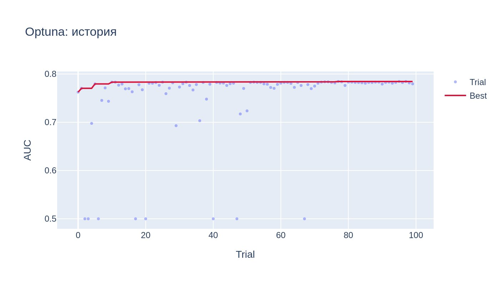
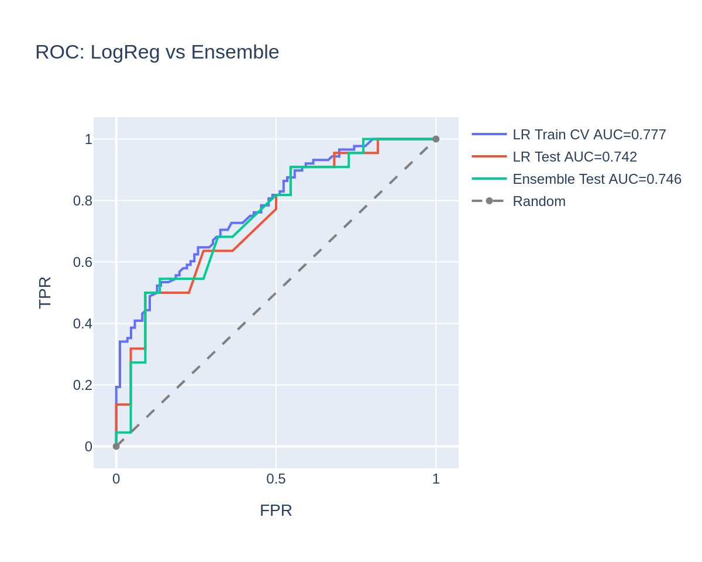
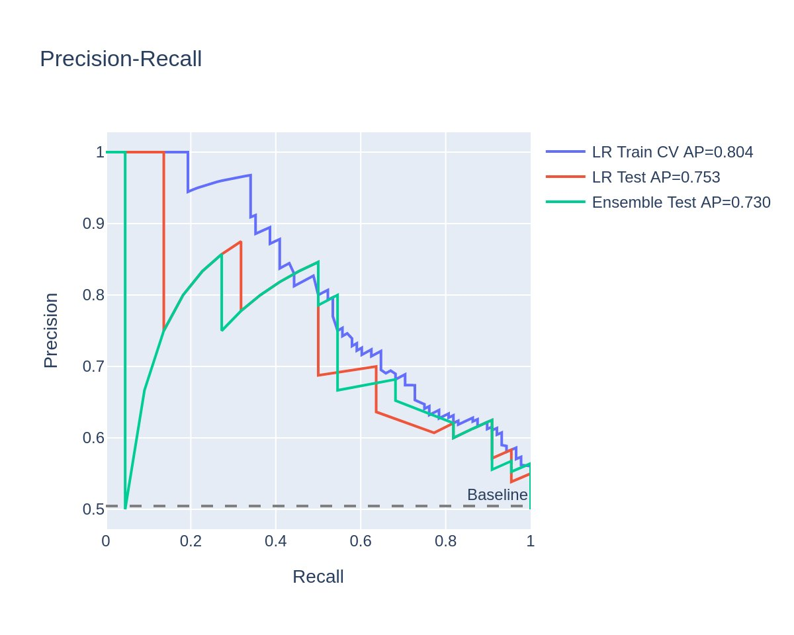
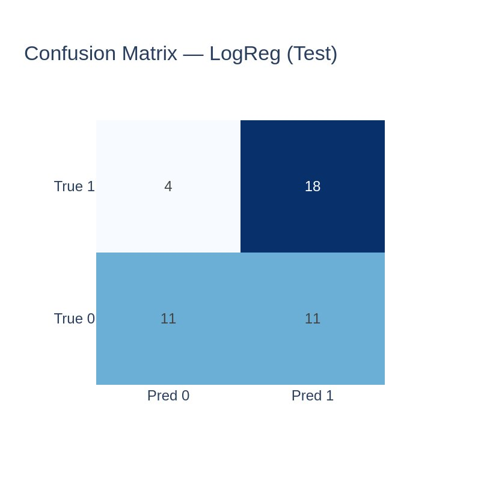
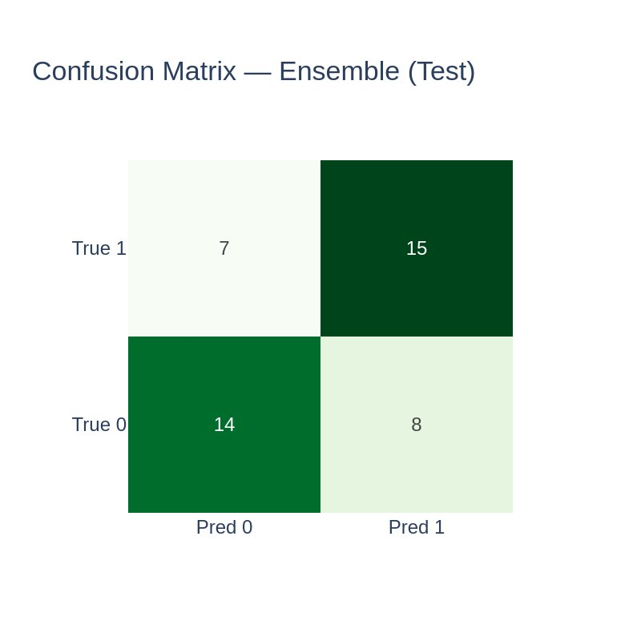
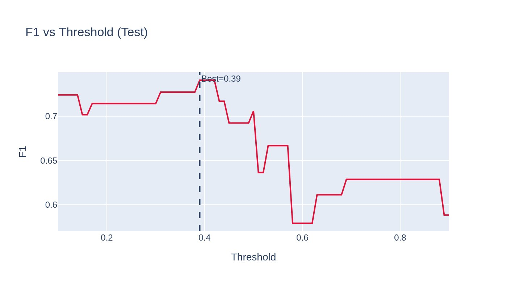
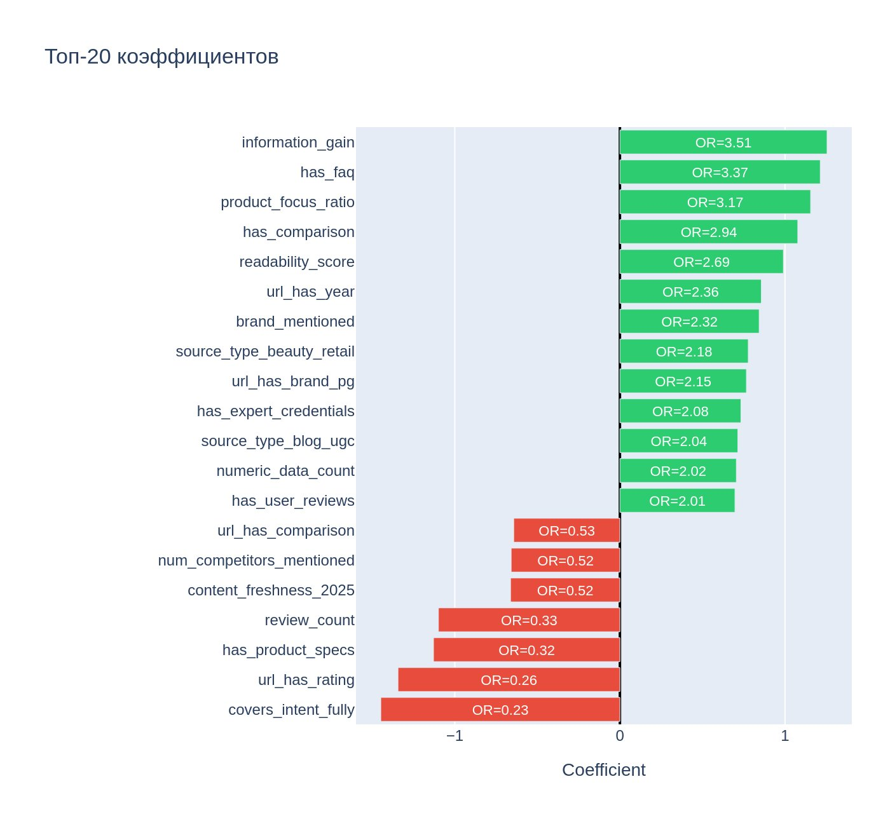
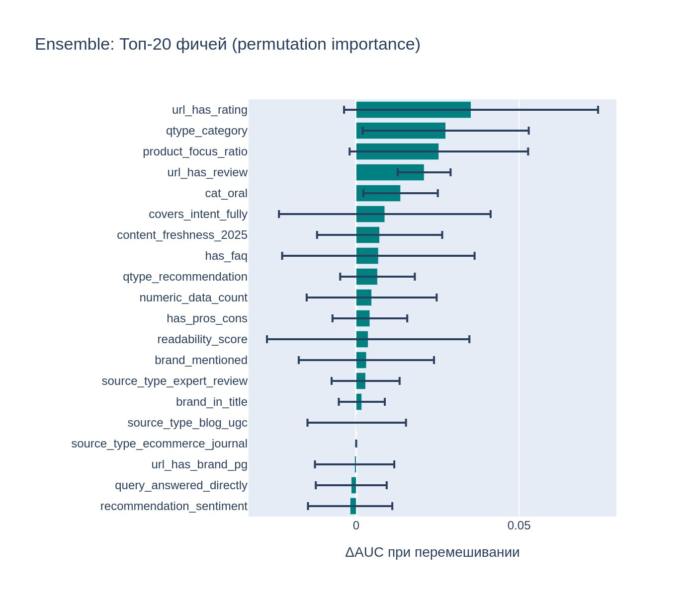
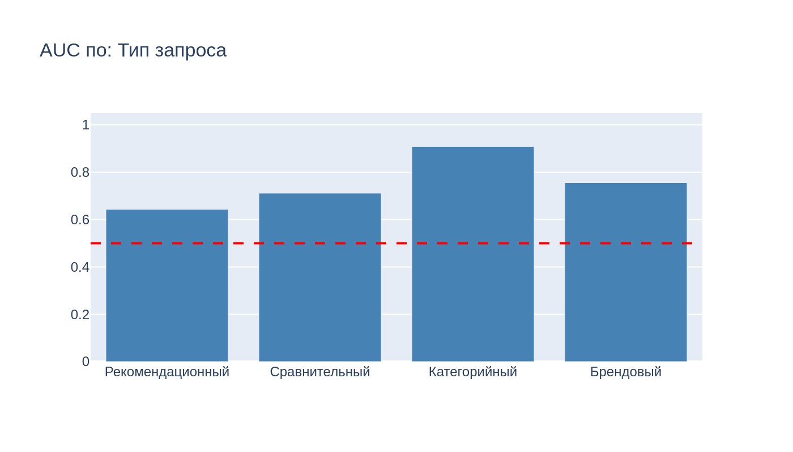
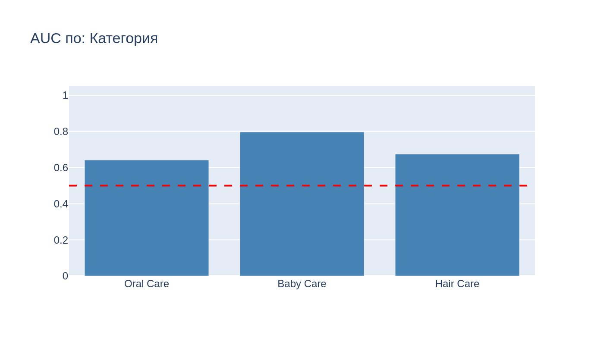

# AI Citation Prediction for P&G Products

Предсказание вероятности цитирования веб-страниц в ответах генеративных нейросетей (AI Overviews) для товаров Procter & Gamble. Модель достигает **AUC = 0.74** на тестовой выборке и выявляет ключевые контент-факторы, влияющие на попадание в ответы AI.

## Контекст задачи

Когда пользователь задаёт поисковый запрос вроде «лучшая зубная паста для ребёнка», поисковые системы всё чаще генерируют ответ с помощью нейросети, которая цитирует отдельные веб-страницы как источники. Для FMCG-бренда критически важно понимать, **какие характеристики контента** повышают шанс оказаться среди цитируемых источников.

Проект решает задачу бинарной классификации: по набору контентных, структурных и SEO-признаков страницы предсказать, будет ли она процитирована в генеративном ответе.

## Данные

Датасет содержит **218 наблюдений** и **62 признака**, собранных по результатам поисковой выдачи для запросов в трёх товарных категориях P&G: Oral Care, Baby Care и Hair Care.

Признаки охватывают несколько групп:

- **Контентные**: уникальность информации (`information_gain`), наличие FAQ, сравнений, отзывов, читаемость текста, доля текста о продукте
- **Структурные**: наличие таблиц, списков, заголовков, спецификаций, экспертных данных
- **URL-сигналы**: содержит ли URL слова review, rating, comparison, brand, год
- **Метаданные источника**: тип площадки (маркетплейс, аптека, экспертный обзор, блог), свежесть контента

Целевая переменная — `cited_in_generative_answer` (1/0), баланс классов умеренный.

## Пайплайн

```
Данные → Очистка → Отбор признаков → Baseline → Оптимизация → Оценка → Выводы
```

### 1. Предобработка и отбор признаков

- Удаление признаков с нулевой дисперсией (`VarianceThreshold`)
- Удаление мультиколлинеарных пар с корреляцией выше 0.90
- Стандартизация (`StandardScaler`)
- Стратифицированный сплит 80/20

Далее — рекурсивный отбор признаков (`RFECV`) с логистической регрессией и AUC в качестве метрики, чтобы оставить только значимые переменные.

### 2. Baseline

Логистическая регрессия с `class_weight="balanced"` даёт базовый AUC на кросс-валидации, от которого отталкивается дальнейшая оптимизация.

### 3. Оптимизация гиперпараметров (Optuna, 100 trials)

Перебор параметров логистической регрессии через TPE-сэмплер:

- Тип регуляризации: L1, L2, ElasticNet
- Сила регуляризации C
- Балансировка классов
- Соотношение L1/L2 для ElasticNet

<p align="center">
  
</p>

### 4. Финальная модель и ансамбль

Обучены две модели для перекрёстной валидации выводов:

- **Логистическая регрессия** (оптимизированная) — основная модель, интерпретируемая через odds ratio
- **VotingClassifier** (LogReg + GradientBoosting, soft voting) — проверка на наличие нелинейных зависимостей

### 5. Анализ результатов

- ROC-кривые и Precision-Recall для train/test обеих моделей
- Confusion matrix
- Подбор оптимального порога классификации (F1 → threshold = 0.39)
- Feature importance: коэффициенты LogReg (odds ratio) и permutation importance ансамбля
- Срезы по типу запроса и товарной категории

## Результаты

| Модель | AUC Train (CV) | AUC Test |
|--------|:--------------:|:--------:|
| Logistic Regression | 0.777 | 0.742 |
| Ensemble (LR + GB) | — | 0.746 |

Разрыв train/test всего 0.035 — переобучения нет. Ансамбль не превосходит логистическую регрессию, что подтверждает: зависимость преимущественно линейная.

### ROC-кривая и Precision-Recall

<p align="center">
  
  
</p>

### Confusion Matrix

<p align="center">
  
  
</p>

### Подбор порога классификации

Оптимальный порог — **0.39** вместо стандартного 0.50. При этом пороге достигается лучший баланс precision/recall.

<p align="center">
  
</p>

### Feature Importance

**Логистическая регрессия** — odds ratio коэффициентов:

<p align="center">
  
</p>

**Ансамбль** — permutation importance:

<p align="center">
  
</p>

### Топ-3 фактора, повышающих цитирование

| Фактор | Odds Ratio | Интерпретация |
|--------|:----------:|---------------|
| `information_gain` | 3.51 | Уникальный контент (собственные данные, тесты) |
| `has_faq` | 3.37 | Наличие блока FAQ на странице |
| `product_focus_ratio` | 3.17 | Высокая доля текста, посвящённого продукту |

### Контринтуитивные находки

- Страницы, «полностью покрывающие запрос» (OR = 0.23), цитируются **реже** — нейросеть предпочитает компактные точные ответы
- Сухие технические характеристики без контекста (OR = 0.32) не цитируются
- Количество отзывов само по себе (OR = 0.33) не помогает — важнее качество контента

### AUC по срезам

<p align="center">
  
  
</p>

- Категорийные запросы («лучшая зубная щётка 2025»): **AUC = 0.90**
- Брендовые запросы («Oral-B отзывы»): **AUC = 0.75**
- Рекомендационные запросы («какую пасту выбрать для ребёнка»): **AUC = 0.64**

## Структура репозитория

```
├── README.md                      ← описание проекта
├── notebooks/
│   └── model_training.ipynb       ← основной ноутбук с пайплайном
├── data/
│   └── PG_GEO_Dataset.xlsx        ← датасет (218 наблюдений, 62 признака)
├── plots/                         ← визуализации результатов
│   ├── 01_feature_importance.png
│   ├── 01b_ensemble_importance.png
│   ├── 02_roc_curve.png
│   ├── 03_precision_recall.png
│   ├── 04_confusion_lr.png
│   ├── 05_confusion_ensemble.png
│   ├── 06_threshold.png
│   ├── 07_auc_query_type.png
│   ├── 07_auc_product_category.png
│   └── 08_optuna_history.png
├── reports/
│   └── model_summary.pdf          ← отчёт с выводами и визуализациями
├── requirements.txt               ← зависимости
├── .gitignore
└── LICENSE
```

## Как запустить

```bash
# Клонировать репозиторий
git clone https://github.com/<your-username>/ai-citation-prediction.git
cd ai-citation-prediction

# Установить зависимости
pip install -r requirements.txt

# Открыть ноутбук
jupyter notebook notebooks/model_training.ipynb
```

## Стек

- **Python 3.10+**
- pandas, numpy — обработка данных
- scikit-learn — моделирование (LogisticRegression, GradientBoosting, VotingClassifier, RFECV, StratifiedKFold)
- Optuna — байесовская оптимизация гиперпараметров
- Plotly + Kaleido — визуализация

## Навыки, применённые в проекте

- Постановка ML-задачи из бизнес-контекста (GEO-оптимизация для FMCG)
- Предобработка данных: фильтрация, масштабирование, борьба с мультиколлинеарностью
- Feature selection (VarianceThreshold, корреляционная матрица, RFECV)
- Настройка гиперпараметров с Optuna (TPE-сэмплер, 100 trials)
- Валидация модели: стратифицированная кросс-валидация, контроль переобучения, подбор порога
- Сравнение линейной и нелинейной модели для проверки устойчивости выводов
- Интерпретация: odds ratio, permutation importance, срезы по сегментам
- Визуализация результатов (ROC, PR-curve, confusion matrix, threshold sweep)
- Формулирование actionable-рекомендаций из результатов модели

## Лицензия

Этот проект распространяется под лицензией [CC BY-NC-SA 4.0](https://creativecommons.org/licenses/by-nc-sa/4.0/).
